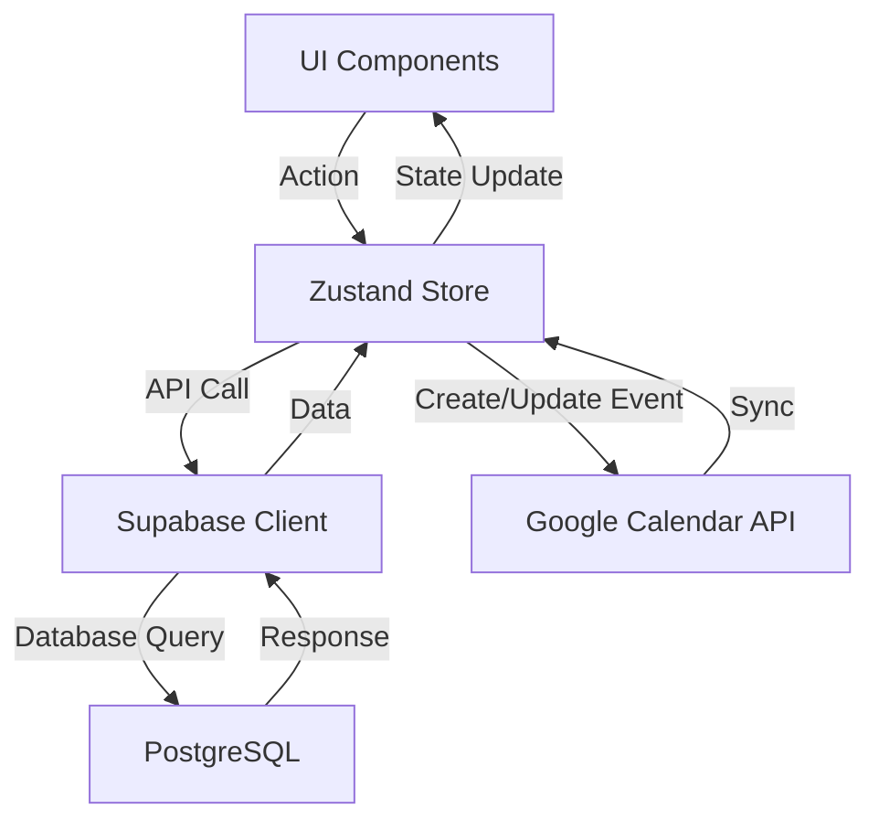
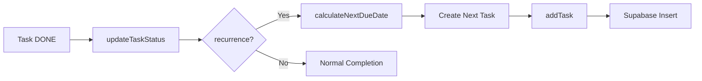

# Vectodo - タスク管理アプリケーション 完全ドキュメント

## 📋 目次

1. [概要](#概要)
2. [主要機能](#主要機能)
3. [技術スタック](#技術スタック)
4. [アーキテクチャ](#アーキテクチャ)
5. [データ構造](#データ構造)
6. [コア機能の実装詳細](#コア機能の実装詳細)
7. [ビュー・UI コンポーネント](#ビューui-コンポーネント)
8. [ユーティリティ・ヘルパー](#ユーティリティヘルパー)
9. [外部サービス連携](#外部サービス連携)
10. [開発ガイド](#開発ガイド)

---

## 概要

**Vectodo**は、タスク管理を多角的な視点から支援する次世代タスク管理アプリケーションです。単一のタスクリストだけでなく、カンバンボード、カレンダー、フローダイアグラム（PERT図）など、複数のビューで同じタスクを可視化できます。

### 🎯 コンセプト

- **多視点タスク管理**: 同じタスクを異なる視点（リスト、カンバン、カレンダー、フロー）で管理
- **アイゼンハワーマトリックス**: 重要度と緊急度による優先順位付け
- **柔軟な繰り返し**: 日次・週次・月次から、特定曜日指定まで対応
- **階層構造**: 親子関係によるタスクの構造化
- **Google Calendar連携**: スケジュールタスクの同期

---

## 主要機能

### 1. タスク管理基本機能

#### タスクCRUD操作
- **作成**: タイトル、説明、期限、見積時間、重要度などを設定
- **更新**: インライン編集、モーダル編集に対応
- **削除**: 単体削除、一括削除（複数選択）
- **ステータス管理**: TODO, DOING, PENDING, DONE の4状態

#### タスク属性
- **タイトル** (title): 必須、タスクの名前
- **説明** (description): 詳細な説明（オプション）
- **期限** (deadline): タスクの締め切り日時
- **見積時間** (estimate_minutes): 作業予定時間（分）
- **実績時間** (actual_minutes): 実際の作業時間（分）
- **重要度** (importance): 0-100のスケール（High: 80+, Medium: 50+, Low: 20+）
- **緊急度** (urgency): 期限から自動計算（詳細は後述）
- **ステータス** (status): TODO/DOING/PENDING/DONE
- **親タスク** (parent_id): 階層構造のための親ID
- **プロジェクトID** (project_id): 所属プロジェクト
- **繰り返し設定** (recurrence): 繰り返しパターン（JSONB）
- **スケジュール** (planned_start, planned_end): 計画された実行時間帯
- **完了日時** (completed_at): タスク完了時刻

### 2. 繰り返しタスク機能 🔄

#### 繰り返しパターン
繰り返しタスクは、タスク完了時に自動的に次回のタスクを生成します。

**プリセットパターン:**
- **毎日**: 毎日同じ時刻に繰り返し
- **平日**: 月曜〜金曜のみ繰り返し
- **毎週**: 毎週同じ曜日に繰り返し
- **毎月**: 毎月同じ日に繰り返し

**カスタムパターン:**
- **間隔**: 1〜100の任意の間隔
- **単位**: 日/週/月
- **曜日指定** (週単位のみ): 複数曜日を選択可能（例: 火曜・木曜）

#### データ構造（recurrence フィールド）
```typescript
interface Recurrence {
  type: 'daily' | 'weekly' | 'monthly';
  interval: number;           // 繰り返し間隔（例: 2 = 隔週）
  days_of_week?: number[];    // 0=日, 1=月, ..., 6=土
}
```

#### 実装詳細
- **次回日付計算**: `calculateNextDueDate()` 関数で次回の期限を計算
- **自動生成**: タスクを`DONE`にすると、`updateTaskStatus()`内で次回タスクを自動作成
- **視覚的表示**: 全てのビューで🔄アイコンを表示（ツールチップで確認可能）

**ファイル:**
- `src/utils/recurrence.ts`: 繰り返しロジックのコア実装
- `src/components/TaskFormModal.tsx`: 繰り返し設定UI

### 3. 緊急度の自動計算

期限までの残り日数に基づいて、緊急度を4段階で自動計算します。

**計算ロジック** (`src/utils/urgency.ts`):
- **Highest** (赤): 期限超過、または1日以内
- **High** (オレンジ): 2-3日以内
- **Medium** (黄): 4-7日以内
- **Low** (グレー): 8日以上、または期限なし

完了済みタスク (`DONE`) の緊急度は常に「Low」として扱われます。

### 4. アイゼンハワーマトリックス

**重要度** (手動設定) × **緊急度** (自動計算) の2軸でタスクを評価。

- 重要度: High (90), Medium (50), Low (20) から選択
- 緊急度: 期限から自動計算
- リストビューやカンバンビューで両方のバッジを表示

### 5. 階層構造（親子関係）

タスクは親子関係を持つことができ、階層的に整理できます。

- **parent_id**: 親タスクのID
- **ドリルダウン**: 親タスクをクリックすると、その子タスクのみを表示
- **サブタスクカウント**: TaskCardで子タスクの数をバッジ表示

**用途:**
- プロジェクトの分解（大タスク → 小タスク）
- タスクのグループ化
- フロービューでの依存関係可視化

### 6. タスク依存関係（PERT/フローダイアグラム用）

タスク間の依存関係を定義し、フロービューで可視化します。

- **dependencies テーブル**: predecessor_id → successor_id
- **ReactFlow**: ノードとエッジで依存関係を描画
- **自動レイアウト**: Dagre アルゴリズムで自動整列
- **手動配置保存**: ドラッグ＆ドロップで配置を調整し、localStorageに保存

**ファイル:**
- `src/features/planning/PlanningTab.tsx`: フロービューの実装
- `src/features/planning/TaskNode.tsx`: ノードコンポーネント
- `src/features/planning/layoutUtils.ts`: レイアウト計算

### 7. Google Calendar 連携

**認証フロー:**
1. Google OAuth 2.0 による認証
2. アクセストークンの取得と保存（localStorage）
3. 自動リフレッシュ（期限切れ時）

**同期機能:**
- **自動同期**: タスクに `planned_start` と `planned_end` を設定すると自動でGoogle Calendarにイベント作成
- **更新同期**: スケジュール変更時にイベントも更新
- **削除同期**: タスク削除時にイベントも削除
- **イベントID保存**: `google_calendar_event_id` フィールドで紐付け

**ファイル:**
- `src/hooks/useGoogleCalendar.ts`: Google Calendar API フック
- `src/utils/googleCalendarSync.ts`: 同期ロジック
- `src/components/GoogleConnectButton.tsx`: 認証ボタン

### 8. バルク操作（一括操作）

リストビューで複数のタスクを選択し、一括操作できます。

- **選択**: チェックボックスでの複数選択
- **一括完了**: 選択したタスクを全て`DONE`にする
- **一括削除**: 選択したタスクを全て削除

**ファイル:**
- `src/components/BulkActionBar.tsx`: バルク操作UI

---

## 技術スタック

### フロントエンド
- **React 18** + **TypeScript**: UIフレームワーク
- **Vite**: ビルドツール
- **Mantine UI v7**: コンポーネントライブラリ
- **Zustand**: 状態管理
- **ReactFlow**: フロー図描画
- **Day.js**: 日付処理
- **Lucide React**: アイコン

### バックエンド
- **Supabase**: BaaS（Backend as a Service）
  - PostgreSQL データベース
  - Row Level Security (RLS) によるアクセス制御
  - リアルタイムサブスクリプション

### 外部サービス
- **Google Calendar API**: カレンダー連携
- **Google OAuth 2.0**: 認証

### 開発ツール
- **ESLint**: 静的解析
- **TypeScript**: 型チェック

---

## アーキテクチャ

### ディレクトリ構造

```
vectodo/
├── src/
│   ├── components/          # 共通UIコンポーネント
│   │   ├── TaskCard.tsx            # タスクカード
│   │   ├── TaskList.tsx            # タスクリスト（テーブル）
│   │   ├── TaskFormModal.tsx       # タスク作成/編集モーダル
│   │   ├── BulkActionBar.tsx       # 一括操作バー
│   │   └── GoogleConnectButton.tsx # Google認証ボタン
│   │
│   ├── features/            # 機能別コンポーネント
│   │   ├── kanban/
│   │   │   ├── KanbanBoard.tsx     # カンバンボード
│   │   │   └── KanbanCard.tsx      # カンバンカード
│   │   ├── calendar/
│   │   │   ├── SchedulingTab.tsx   # カレンダービュー
│   │   │   └── SchedulingModal.tsx # スケジュール設定モーダル
│   │   ├── planning/
│   │   │   ├── PlanningTab.tsx     # フロービュー（PERT図）
│   │   │   ├── TaskNode.tsx        # フローノード
│   │   │   └── layoutUtils.ts      # レイアウト計算
│   │   └── auth/
│   │       └── LoginScreen.tsx     # ログイン画面
│   │
│   ├── stores/              # 状態管理
│   │   ├── taskStore.ts            # タスクストア（メイン）
│   │   └── useToastStore.ts        # トースト通知
│   │
│   ├── utils/               # ユーティリティ
│   │   ├── recurrence.ts           # 繰り返しロジック
│   │   ├── urgency.ts              # 緊急度計算
│   │   ├── taskUtils.ts            # タスク関連ヘルパー
│   │   └── googleCalendarSync.ts   # Google Calendar同期
│   │
│   ├── hooks/               # カスタムフック
│   │   └── useGoogleCalendar.ts    # Google Calendar API
│   │
│   ├── lib/                 # ライブラリ設定
│   │   ├── supabaseClient.ts       # Supabaseクライアント
│   │   └── constants.ts            # 定数定義
│   │
│   ├── supabase-types.ts    # Supabase型定義（自動生成）
│   ├── App.tsx              # メインアプリ
│   └── main.tsx             # エントリーポイント
│
├── supabase-migration-parent-id.sql  # マイグレーション（parent_id追加）
├── supabase-dev-rls.sql              # RLSポリシー
└── package.json
```

### 状態管理フロー



### データフロー（繰り返しタスク）



---

## データ構造

### データベーススキーマ（Supabase）

#### tasks テーブル

| カラム名 | 型 | NULL | デフォルト | 説明 |
|---------|-----|------|-----------|------|
| id | uuid | NO | gen_random_uuid() | 主キー |
| created_at | timestamp | NO | now() | 作成日時 |
| title | text | NO | - | タスクタイトル |
| slug | text | NO | - | 一意識別子（数値文字列） |
| description | text | YES | NULL | 詳細説明 |
| status | text | YES | 'TODO' | ステータス |
| deadline | timestamp | YES | NULL | 期限 |
| estimate_minutes | integer | YES | NULL | 見積時間（分） |
| actual_minutes | integer | YES | NULL | 実績時間（分） |
| importance | integer | YES | NULL | 重要度（0-100） |
| urgency | integer | YES | NULL | 緊急度（廃止、自動計算に移行） |
| completed_at | timestamp | YES | NULL | 完了日時 |
| project_id | text | NO | - | プロジェクトID |
| parent_id | uuid | YES | NULL | 親タスクID |
| planned_start | timestamp | YES | NULL | 計画開始時刻 |
| planned_end | timestamp | YES | NULL | 計画終了時刻 |
| google_calendar_event_id | text | YES | NULL | Google CalendarイベントID |
| **recurrence** | jsonb | YES | NULL | 繰り返し設定 |

**インデックス:**
- `project_id` にインデックス
- `parent_id` にインデックス
- `deadline` にインデックス

#### dependencies テーブル

| カラム名 | 型 | NULL | 説明 |
|---------|-----|------|------|
| id | uuid | NO | 主キー |
| created_at | timestamp | NO | 作成日時 |
| predecessor_id | uuid | NO | 先行タスクID |
| successor_id | uuid | NO | 後続タスクID |

**外部キー:**
- `predecessor_id` → `tasks(id)` (CASCADE DELETE)
- `successor_id` → `tasks(id)` (CASCADE DELETE)

### TypeScript 型定義

#### Task 型（基本）

```typescript
type Task = Tables<'tasks'>;  // Supabaseから自動生成

// 展開すると:
interface Task {
  id: string;
  created_at: string;
  title: string;
  slug: string;
  description: string | null;
  status: string | null;
  deadline: string | null;
  estimate_minutes: number | null;
  actual_minutes: number | null;
  importance: number | null;
  urgency: number | null;
  completed_at: string | null;
  project_id: string;
  parent_id: string | null;
  planned_start: string | null;
  planned_end: string | null;
  google_calendar_event_id: string | null;
  recurrence: Json | null;  // JSONB型
}
```

#### TaskData 型（作成・更新用）

```typescript
interface TaskData {
  title: string;
  project_id: string;
  estimate_minutes?: number | null;
  deadline?: string | null;
  importance?: number | null;
  description?: string | null;
  parent_id?: string | null;
  planned_start?: string | null;
  planned_end?: string | null;
  recurrence?: Recurrence | null;
}
```

#### Recurrence 型

```typescript
interface Recurrence {
  type: 'daily' | 'weekly' | 'monthly';
  interval: number;
  days_of_week?: number[];  // 0=日曜, 1=月曜, ..., 6=土曜
}
```

---

## コア機能の実装詳細

### 1. タスクストア (`src/stores/taskStore.ts`)

Zustandを使用したグローバル状態管理。

#### 主要ステート

```typescript
interface TaskStore {
  tasks: Task[];                    // 全タスク
  dependencies: Dependency[];       // タスク依存関係
  loading: boolean;                 // ローディング状態
  error: string | null;             // エラーメッセージ
  currentProjectId: string | null;  // 現在のプロジェクトID（階層ナビゲーション用）
  showCompletedTasks: boolean;      // 完了タスクの表示フラグ
  activeTaskId: string | null;      // アクティブなタスクID（タイマー用）
}
```

#### 主要アクション

**CRUD操作:**
- `fetchTasks()`: タスク一覧を取得
- `addTask(taskData)`: 新規タスク作成
- `updateTask(taskId, updates)`: タスク更新
- `updateTaskStatus(taskId, status)`: ステータス更新 + 繰り返しタスク自動生成
- `updateTaskImportance(taskId, importance)`: 重要度更新
- `deleteTasks(taskIds)`: タスク削除（単体または複数）

**階層ナビゲーション:**
- `setCurrentProject(taskId)`: 現在のプロジェクトを設定（ドリルダウン）
- `navigateUp()`: 親階層に戻る

**タイマー機能:**
- `startTimer(taskId)`: タスクのタイマー開始
- `stopTimer()`: タイマー停止と実績時間の記録

**依存関係:**
- `addDependency(predecessorId, successorId)`: 依存関係追加
- `removeDependency(predecessorId, successorId)`: 依存関係削除
- `fetchDependencies()`: 依存関係取得

### 2. 繰り返しロジック (`src/utils/recurrence.ts`)

#### calculateNextDueDate()

現在の期限日と繰り返しパターンから、次回の期限日を計算します。

**アルゴリズム:**

1. **日次 (daily)**:
   ```
   次回 = 現在 + interval日
   ```

2. **月次 (monthly)**:
   ```
   次回 = 現在 + interval ヶ月（同じ日）
   ```

3. **週次 (weekly)**:
   - **曜日指定なし**: 次回 = 現在 + interval週
   - **曜日指定あり**:
     1. 現在の曜日より後で、同じ週内に該当曜日があればその日
     2. なければ、interval週後の最初の該当曜日

**例（隔週の火曜・木曜）:**
```
現在: 2025-12-23 (火)
次回: 2025-12-25 (木)  # 同じ週内

現在: 2025-12-25 (木)
次回: 2026-01-07 (火)  # 2週間後の火曜
```

#### getRecurrenceDescription()

繰り返しパターンを人間が読みやすい日本語に変換します。

```typescript
// 例
{ type: 'daily', interval: 1 } 
→ "毎日"

{ type: 'weekly', interval: 2, days_of_week: [1, 3, 5] }
→ "2週ごとに月曜, 水曜, 金曜"
```

### 3. 緊急度計算 (`src/utils/urgency.ts`)

#### calculateUrgencyFromDeadline()

期限までの残り日数から緊急度を計算します。

```typescript
interface UrgencyConfig {
  level: number;      // 0-100のスケール
  label: string;      // 日本語ラベル
  color: string;      // Mantine カラー
  icon: string;       // アイコン種別
}
```

**計算ロジック:**
```typescript
if (完了済み) return { level: 0, label: 'なし', color: 'gray' };
if (期限なし) return { level: 0, label: 'なし', color: 'gray' };

const 残り日数 = deadline - 今日;
if (残り日数 < 0) return { level: 100, label: '超過', color: 'red', icon: 'alert' };
if (残り日数 <= 1) return { level: 95, label: '緊急', color: 'red', icon: 'flame' };
if (残り日数 <= 3) return { level: 80, label: '高', color: 'orange', icon: 'warning' };
if (残り日数 <= 7) return { level: 50, label: '中', color: 'yellow' };
return { level: 20, label: '低', color: 'gray' };
```

### 4. Google Calendar 同期 (`src/utils/googleCalendarSync.ts`)

#### createGoogleEvent()

タスクのスケジュール（planned_start, planned_end）からGoogle Calendarイベントを作成します。

```typescript
async function createGoogleEvent(task: Task, accessToken: string): Promise<string>
```

**処理フロー:**
1. アクセストークンの有効性チェック
2. Google Calendar API に POST リクエスト
3. イベントIDを返す
4. taskStore で `google_calendar_event_id` を保存

#### updateGoogleEvent()

既存のイベントを更新します。

```typescript
async function updateGoogleEvent(eventId: string, task: Task, accessToken: string): Promise<void>
```

#### deleteGoogleEvent()

イベントを削除します。

```typescript
async function deleteGoogleEvent(eventId: string, accessToken: string): Promise<void>
```

#### 自動同期トリガー

以下のタイミングで自動的に同期が実行されます:

1. **タスク作成時** (`addTask`):
   - `planned_start` と `planned_end` が両方設定されている場合
   
2. **タスク更新時** (`updateTask`):
   - スケジュールが変更された場合
   - 既存イベントがあれば更新、なければ新規作成

3. **タスク削除時** (`deleteTask`):
   - `google_calendar_event_id` があれば削除

---

## ビュー・UI コンポーネント

### 1. リストビュー (`src/components/TaskList.tsx`)

テーブル形式でタスクを一覧表示します。

**特徴:**
- **インライン編集**: タイトル、スケジュール、期限をその場で編集
- **複数選択**: チェックボックスで複数タスクを選択
- **一括操作**: 選択したタスクを一括完了/削除
- **ソート**: 各カラムでソート可能
- **ステータス変更**: ドロップダウンメニューで変更
- **重要度/緊急度表示**: バッジで視覚的に表示
- **繰り返しアイコン**: 🔄アイコンで繰り返しタスクを明示

**表示カラム:**
- 選択チェックボックス
- 完了チェックボックス
- ステータス
- 重要度
- 緊急度（自動計算）
- タイトル + 繰り返しアイコン
- 開始時刻
- 終了時刻
- 期限
- 操作（編集・削除）

### 2. カンバンビュー (`src/features/kanban/KanbanBoard.tsx`)

ステータスごとにカラムを分けて表示します。

**カラム:**
- **TODO**: 未着手
- **DOING**: 進行中
- **PENDING**: 保留
- **DONE**: 完了

**KanbanCard の表示内容:**
- タイトル + 繰り返しアイコン
- 説明（2行まで）
- 期限バッジ（超過時は赤）
- 見積時間
- 重要度バッジ（クリックで変更可能）
- 緊急度バッジ（自動計算）
- 完了日時（完了済みの場合）
- 編集ボタン

**操作:**
- カードクリックでドリルダウン
- ドラッグ&ドロップでステータス変更（実装予定）

### 3. カレンダービュー (`src/features/calendar/SchedulingTab.tsx`)

月次カレンダーでタスクのスケジュールを可視化します。

**表示:**
- `planned_start` と `planned_end` が設定されたタスクのみ表示
- タスクを時間帯ごとに配置
- Google Calendar イベントも表示

**操作:**
- カレンダー上のタスクをクリックで詳細表示
- SchedulingModal でスケジュール設定
- Google Calendar との同期

### 4. フロービュー (`src/features/planning/PlanningTab.tsx`)

タスクをノードとして、依存関係をエッジとして可視化します。

**使用ライブラリ:**
- ReactFlow: フローダイアグラム描画

**TaskNode の表示内容:**
- タイトル
- ステータスバッジ
- 期限 + 繰り返しアイコン
- 見積時間（右側に大きく表示）
- ステータスに応じた左ボーダー色
- 高緊急度タスクは背景に薄い赤/オレンジのオーバーレイ

**操作:**
- **ノードドラッグ**: 自由に配置を変更（localStorage に保存）
- **エッジ作成**: ノード間をドラッグして依存関係を作成
- **エッジ削除**: エッジを選択してDeleteキー
- **自動整列**: Dagreアルゴリズムで自動レイアウト
- **ノードクリック**: ドリルダウン（その タスクの子タスクを表示）

**レイアウト:**
- 初回表示: 自動レイアウト
- ドラッグ後: localStorageに位置を保存
- 「自動整列」ボタン: 手動でレイアウトをリセット

### 5. TaskFormModal (`src/components/TaskFormModal.tsx`)

タスクの作成・編集モーダルです。

**入力フィールド:**
- **タイトル** (必須)
- **説明**
- **見積時間**
- **期限** (DateTimePicker)
- **重要度** (SegmentedControl: High/Medium/Low)
- **ステータス** (Select: TODO/DOING/PENDING/DONE)
- **スケジュール** (開始・終了時刻)
- **親タスク** (Select: 階層構造)
- **繰り返し設定** (新機能):
  - プリセット選択: なし/毎日/平日/毎週/毎月/カスタム
  - カスタム設定 (Collapse):
    - 間隔 (NumberInput)
    - 単位 (Select: 日/週/月)
    - 曜日選択 (Chip.Group: 週単位のみ表示)

**バリデーション:**
- タイトルは必須
- 見積時間は0以上

**保存処理:**
1. フォーム値から `TaskData` を構築
2. 繰り返しプリセットまたはカスタム設定から `Recurrence` オブジェクトを作成
3. `addTask()` または `updateTask()` を呼び出し

---

## ユーティリティ・ヘルパー

### taskUtils.ts

タスク関連のヘルパー関数群。

#### getStatusConfig()

ステータスに応じた設定（色、ラベル）を返します。

```typescript
function getStatusConfig(status: string | null): {
  color: string;
  label: string;
}
```

**例:**
```typescript
getStatusConfig('TODO')    // { color: 'blue', label: 'To Do' }
getStatusConfig('DOING')   // { color: 'yellow', label: 'In Progress' }
getStatusConfig('DONE')    // { color: 'green', label: 'Done' }
getStatusConfig('PENDING') // { color: 'gray', label: 'Pending' }
```

#### getImportanceConfig()

重要度に応じた設定（色、ラベル）を返します。

```typescript
function getImportanceConfig(importance: number | null): {
  color: string;
  label: string;
}
```

**例:**
```typescript
getImportanceConfig(90)   // { color: 'violet', label: '高' }
getImportanceConfig(50)   // { color: 'grape', label: '中' }
getImportanceConfig(20)   // { color: 'indigo', label: '低' }
getImportanceConfig(null) // { color: 'gray', label: 'なし' }
```

### layoutUtils.ts

フロービューのレイアウト計算。

#### getLayoutedElements()

Dagre アルゴリズムを使用してノードとエッジを自動配置します。

```typescript
function getLayoutedElements(
  nodes: Node[],
  edges: Edge[],
  direction: 'TB' | 'LR' = 'TB'
): { nodes: Node[]; edges: Edge[] }
```

**パラメータ:**
- `direction`: 'TB' (上から下) または 'LR' (左から右)

**処理フロー:**
1. Dagre グラフ作成
2. ノードをグラフに追加
3. エッジをグラフに追加
4. レイアウト計算 (`layout()`)
5. 計算された位置をノードに適用

---

## 外部サービス連携

### Google Calendar API

#### 認証フロー

1. **Google OAuth同意画面**: ユーザーが Google アカウントでログイン
2. **認証コード取得**: リダイレクトURLでコードを受け取る
3. **トークン交換**: 認証コードをアクセストークンに交換
4. **トークン保存**: localStorage に保存
5. **自動リフレッシュ**: アクセストークン期限切れ時にリフレッシュトークンで更新

#### 使用スコープ

```
https://www.googleapis.com/auth/calendar.events
```

カレンダーイベントの読み書き権限のみ。

#### API エンドポイント

**イベント作成:**
```
POST https://www.googleapis.com/calendar/v3/calendars/primary/events
```

**イベント更新:**
```
PUT https://www.googleapis.com/calendar/v3/calendars/primary/events/{eventId}
```

**イベント削除:**
```
DELETE https://www.googleapis.com/calendar/v3/calendars/primary/events/{eventId}
```

### Supabase

#### 認証

現在は開発環境用のRLSポリシーを使用（全ユーザーがアクセス可能）。

本番環境では、ユーザー認証を実装し、Row Level Security で各ユーザーのデータを保護する必要があります。

#### リアルタイム機能

Supabase のリアルタイムサブスクリプション機能は現在未使用ですが、将来的に複数デバイス間の同期に活用できます。

---

## 開発ガイド

### セットアップ

1. **依存関係インストール:**
   ```bash
   npm install
   ```

2. **環境変数設定:**
   `.env` ファイルを作成し、以下を設定:
   ```
   VITE_SUPABASE_URL=your_supabase_url
   VITE_SUPABASE_ANON_KEY=your_supabase_anon_key
   VITE_GOOGLE_CLIENT_ID=your_google_client_id
   ```

3. **開発サーバー起動:**
   ```bash
   npm run dev
   ```

### タスク管理のベストプラクティス

1. **階層構造**: 大きなプロジェクトは親タスクとして、小タスクを子として分解
2. **重要度設定**: アイゼンハワーマトリックスを意識して設定
3. **期限設定**: 緊急度が自動計算されるため、期限を必ず設定
4. **繰り返しタスク**: 定期的なタスクには繰り返しを設定して自動化
5. **スケジュール**: カレンダービューで視覚的に管理したいタスクには計画時間を設定

### 今後の実装予定機能

- [ ] ユーザー認証（Supabase Auth）
- [ ] マルチユーザー対応
- [ ] カンバンボードのドラッグ&ドロップ
- [ ] タグ機能
- [ ] ファイル添付
- [ ] コメント機能
- [ ] 通知機能（期限アラート）
- [ ] レポート機能（生産性分析）
- [ ] PWA対応（オフライン動作）
- [ ] モバイルアプリ（React Native）

---

## トラブルシューティング

### Google Calendar 同期エラー

**症状**: イベントが作成されない

**原因と対処:**
1. アクセストークンの期限切れ → ログアウト後、再度認証
2. スコープ不足 → OAuth同意画面で正しいスコープを許可
3. ネットワークエラー → ブラウザの開発者ツールでネットワークタブを確認

### タスクが表示されない

**症状**: タスクを作成したのに表示されない

**原因と対処:**
1. 階層フィルタ → 「完了タスクを表示」をONにする
2. 現在のプロジェクトが間違っている → パンくずリストで親階層に戻る
3. ステータスフィルタ → フィルタ設定を確認

### フロービューのレイアウトが崩れる

**症状**: ノードが重なって表示される

**対処:**
1. 「自動整列」ボタンをクリック
2. localStorage をクリアして再読み込み
3. ブラウザのキャッシュをクリア

---

## まとめ

**Vectodo**は、タスク管理を多角的に可視化し、柔軟な繰り返し機能や自動計算による優先順位付け、Google Calendar連携など、現代のタスク管理に必要な機能を統合したアプリケーションです。

React + TypeScript + Supabase のモダンな技術スタックで構築され、拡張性の高いアーキテクチャを採用しています。今後も機能追加や改善を継続的に行い、より使いやすいタスク管理ツールを目指します。

---

**最終更新**: 2025-12-22  
**バージョン**: 1.0.0
